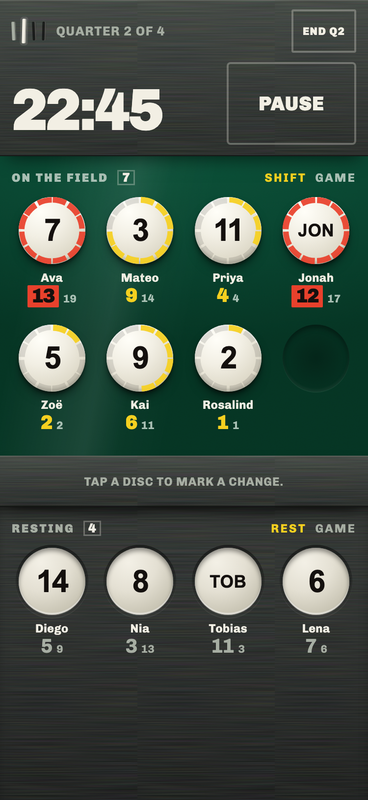
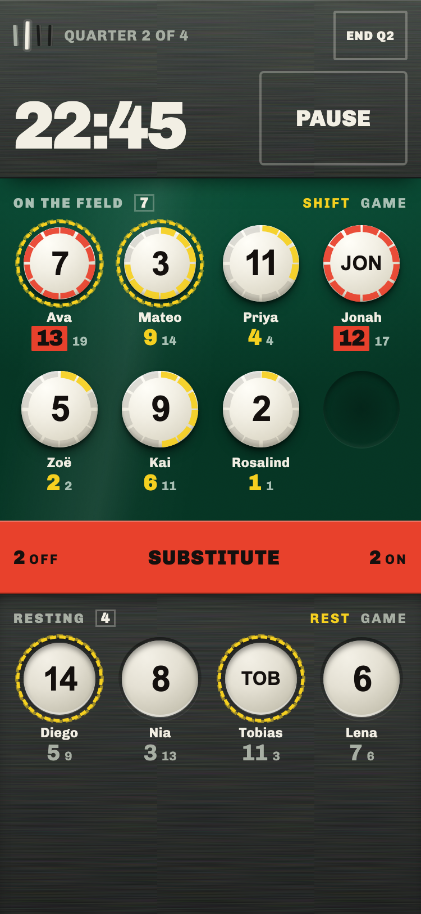

# team-sub

A sideline substitution tracker for volunteer youth rec soccer coaches.

It holds the thing a coach would otherwise keep in their head or on a damp paper roster: who is on the field, who is resting, and how long each has been there. It is built to be read in a glance between plays, on a phone, held in one hand, in direct daylight.

**Live: https://jbudge3.github.io/team-sub/**



## How it works

Each player is a disc. Discs on the green are on the field, discs on the grey tray are resting, and they never change places on their own. The ring around a disc fills one wedge per minute of the current shift, so the player who has been out longest is the one with the most ring. Twelve wedges is a full ring, and past that the disc turns red.

Two figures sit under every name. The large one is the current shift or rest, the small one is the game total.

### Substitutions stage, then commit

The coach marks players while play continues, then commits the whole change at the next stoppage.

Tapping a disc marks it with a dashed ring. The rail between the two regions counts what is marked and stays inert until the numbers balance and the field would still be legal. When they balance it turns red and reads **Substitute**. Committing slides every marked disc across at once and starts a fresh shift for each player involved.



### The clock is yours

The clock is coach-run game time, not wall time. Player minutes accrue only while it runs, so stoppages and halftime cost nobody. Paused is deliberately loud: the board dulls and every ring stops, because a coach who forgets to restart the clock corrupts the whole record.

Elapsed time is computed from stored timestamps rather than a tick counter. A locked screen, a backgrounded tab, or a reload cannot make it drift.

### Full time

The last period ends and the board simply stops. Discs go inert, the game total becomes the prominent figure, and everything stays readable. There is no summary screen to dismiss.

## Setup

The roster is entered once and stays on the device between games. Numbers are optional and may repeat, which rec leagues tend to require. Format is configurable: 3 to 11 on the field, 1 to 4 quarters, up to 22 players.

## Running it locally

No build step, no dependencies, no backend. Serve the directory over HTTP and open it.

```bash
python3 -m http.server 4173
```

Then visit http://localhost:4173. Opening `index.html` from the filesystem works too, though a server matches how it is hosted.

## Data and privacy

Everything lives in `localStorage` under the key `team-sub:v1`, on the one device and browser it was entered on. There is no server, no account, and no network call, which also means it works with no signal at the field. It does not sync between devices, and clearing browser data clears the roster.

## What it deliberately does not do

No positions, formations, or pitch diagram. It tracks on and off, not where. No engine that names the next substitution for you; time is made visible and the call stays yours. No export, sharing, or post-game record. No accounts, analytics, or sound.

## Repository

| Path | What it is |
| --- | --- |
| `index.html`, `app.js`, `styles.css` | The whole application |
| `fonts/` | Chivo, subset to latin and latin-ext |
| `PRODUCT.md` | Who this is for, and the decisions left open on purpose |
| `DESIGN.md` | The design system, derived from the shipped artifact |
| `.impeccable/` | Design process state and the reviewed screenshots |

## License

[MIT](LICENSE).

The bundled Chivo font files in `fonts/` are not covered by that. Chivo is copyright 2019 The Chivo Project Authors and is released under the SIL Open Font License 1.1, a copy of which sits alongside them in [`fonts/OFL.txt`](fonts/OFL.txt). The files here are subsets of the upstream font, cut down to latin and latin-ext.
